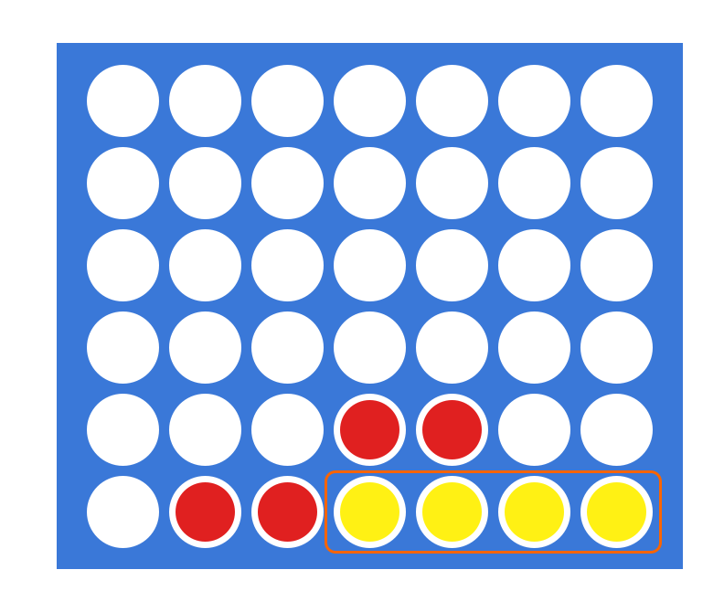
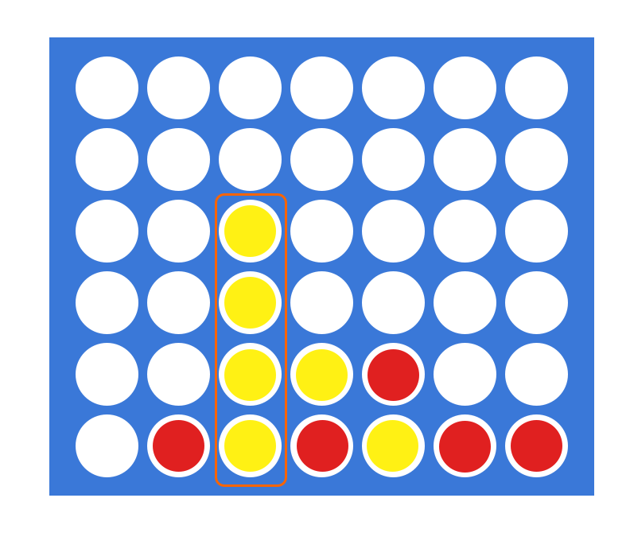

## Kata n.02

**Date:** 19/11/2021

**Topic:** Connect Four

### Description:

[Connect Four](https://www.wikiwand.com/en/Connect_Four) (also known as Four in a Row) is a board game in which the players choose a color and then take turns dropping colored discs into a seven-column, six-row vertically suspended grid.


The objective of the game is to be the first to form a horizontal, vertical, or diagonal line of four of one's own discs:






The goal of this code Kata is to implement a `checkForWinner` function, which will receive a board snapshot and will return:

`PLAYER1`: if winner is player one

`PLAYER2`: if winner is player two

`NO-WINNER`: if there is no winner

The board has 6 rows and 7 columns and is defined as a multidimensional array. **This is guaranteed**, so you don't have to cater for different board sizes.
Each slot will either contain:

`0`: slot is empty

`1`: slot contains a token from player one

`2`: slot contains a token from player two

A sample board will look like this:

```
const board = [
    [0, 0, 0, 0, 0, 0, 0],
    [0, 0, 0, 0, 0, 0, 0],
    [0, 0, 0, 0, 0, 0, 0],
    [0, 0, 0, 0, 0, 0, 0],
    [2, 1, 1, 1, 1, 0, 0],
    [1, 2, 2, 2, 1, 2, 2],
] as TBoardMatrix;

```

In this example the expected returned value is `PLAYER1`, since player 1 successfully completed a sequence of four. Please note that there can only be one sequence at a time. This is because, per game rules, the game stops when there is a winner.

### Implementation details:

The function called `checkForWinner` is already bootstrapped in `src/02/index.tsx`. Put your code inside here. To execute the code simply run `yarn start`.
When you're done, run `yarn test` to verify that your solution is correct.

### Useful resources 🙂

To help you with the implementation, here are some graphic representation of the array positions and of all the possible diagonals:


